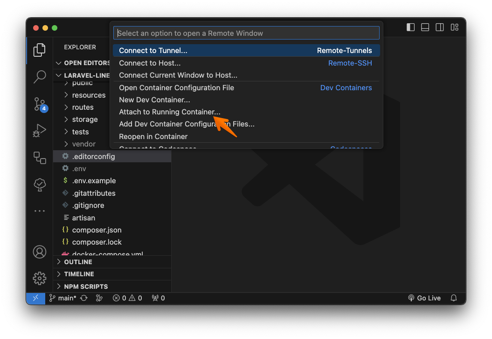
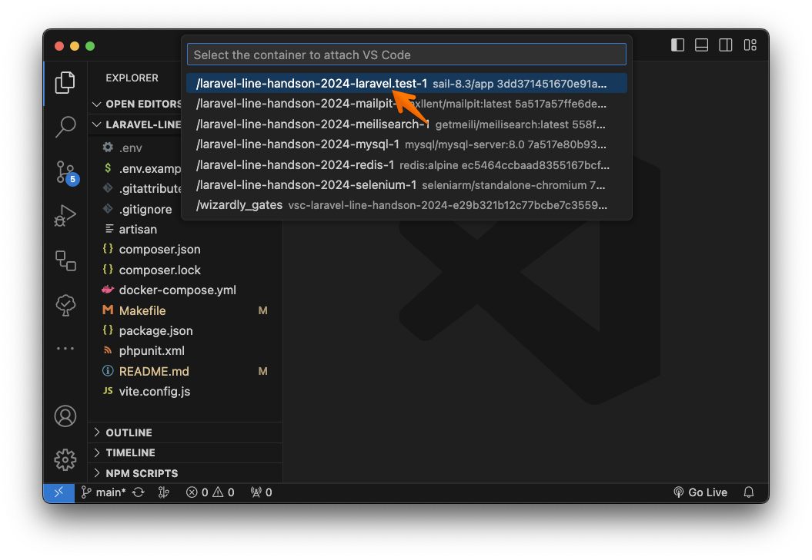
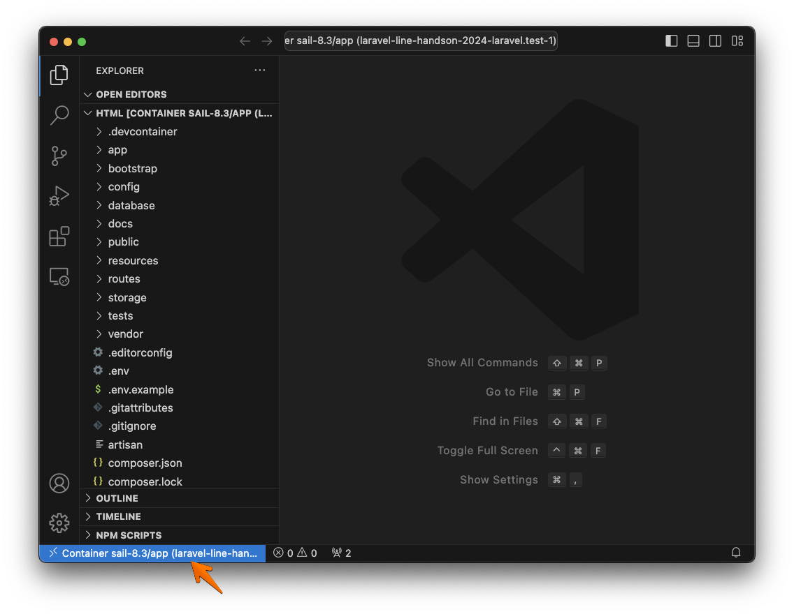
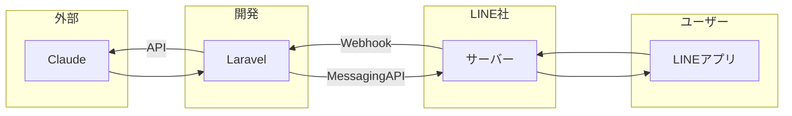
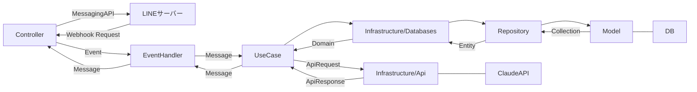

# laravel-line-handson-2024

本リポジトリは下記ハンズオンイベントで利用するソースコードです

https://linedevelopercommunity.connpass.com/event/313579/

## 推奨エディター

- VSCode

> 上記エディターのみ確認しています

## 実行

### インストール & コンテナ起動

```bash
make
```

> make は下記のエイリアスです
>
> ```
> make install
> make down
> make copy-env-if-not-exist
> make up
> ```

<details>

<summary>各コマンドについて</summary>

### インストールのみ

```bash
make install
```

### .env 生成

```bash
make copy-env-if-not-exist
```

### コンテナ起動

```bash
make up
```

### コンテナ終了

```bash
make down
```

</details>

## ポートフォワード

ローカルで開発する際に、特定のポートをグローバルに公開して動作確認することができます

> 事前に [devtunnel](https://learn.microsoft.com/ja-jp/azure/developer/dev-tunnels/get-started?tabs=macos) をインストールしてください

```bash
make tunnel
```

## 環境変数

|項目名|値|備考|
|--|--|--|
|APP_URL|`https://*****-20080.asse.devtunnels.ms`|devtunnelの`Connect via browser`に表示されるURLを設定する|
|LINE_CHANNEL_SECRET|`*****`|[LINE Developers](https://developers.line.biz/ja/) > チャネル基本設定 > チャネルシークレット|
|LINE_CHANNEL_ACCESS_TOKEN|`*****`|[LINE Developers](https://developers.line.biz/ja/) > Messaging API 設定 > チャネルアクセストークン|
|CLAUDE_API_KEY|`sk-*****`|[Anthropic Console > API Keys](https://console.anthropic.com/settings/keys) から発行する|

## Dev Container

コンテナ起動後に `laravel.test-1` にアタッチする

### 操作イメージ

<details>

<summary>クリックして表示</summary>






> `Container ~~~` と表示されていれば OK

</details>

## システム概要

### 全体像



### クラス依存関係


